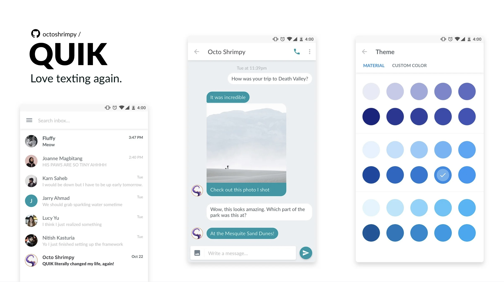

# QUIK

QUIK is an open source replacement to the [stock messaging app](https://github.com/android/platform_packages_apps_mms) on Android. It is a continuation of [QKSMS](https://github.com/moezbhatti/qksms). 

## Features

- Scheduled messages
- Message backup
- Speech-to-text and text-to-speech integrated within the app
- Message blocking and archiving
- Voice messages
- Attachments of any type of file
- Message sorting
- Message pinning
- Delayed sending
- Quick reply from notifications
- Swipe actions
- Emoji reaction handling
- and much, much more

## Download

Grab QUIK from the official [github releases page](https://github.com/octoshrimpy/quik/releases), or keep up with updates with the following:

<!--
</a><a href="https://play.google.com/store/apps/details?id=dev.octoshrimpy.quik">
-->

## Matrix Chat
You can chat with the community over at [#quik-sms:matrix.org](https://matrix.to/#/#quik-sms:matrix.org)

## Reporting bugs

A great bug report contains a description of the problem and steps to reproduce the problem. We need to know what we're looking for and where to look for it.

When reporting a bug, please make sure to provide the following information:
- Steps to reproduce the issue
- QUIK version
- Device / OS information

## Contributing
Contributions are very welcome! Please see the [contributing guidelines](/CONTRIBUTING.md) for details.

## Translations
If you'd like to add translations to QUIK, please join the project on [Weblate](https://hosted.weblate.org/engage/quik/)! Translations that are committed directly to source files will not be accepted. For more information see the [translation guidelines](/CONTRIBUTING.md#translate).

## Thank you

A special thank you to Jake ([@klinker41](https://github.com/klinker41)) and Luke Klinker ([@klinker24](https://github.com/klinker24)) for their work on [android-smsmms](https://github.com/klinker41/android-smsmms), which has been an unspeakably large help in implementing MMS into QUIK.

A giant thank you to Moez [moezbhatti](https://github.com/moezbhatti) for creating and maintaining QKSMS, of which QUIK would not exist without.

## Contact

QUIK is developed and maintained by [Marcos Jones](https://github.com/octoshrimpy).

---

## Star History

<a href="https://star-history.com/#octoshrimpy/quik&Date">
  <picture>
    <source media="(prefers-color-scheme: dark)" srcset="https://api.star-history.com/svg?repos=octoshrimpy/quik&type=Date&theme=dark" />
    <source media="(prefers-color-scheme: light)" srcset="https://api.star-history.com/svg?repos=octoshrimpy/quik&type=Date" />
    
  </picture>
</a>

---

<!--  -->

## License

QUIK is released under the **The GNU General Public License v3.0 (GPLv3)**, which can be found in the [LICENSE](LICENSE) file in the root of this project.
